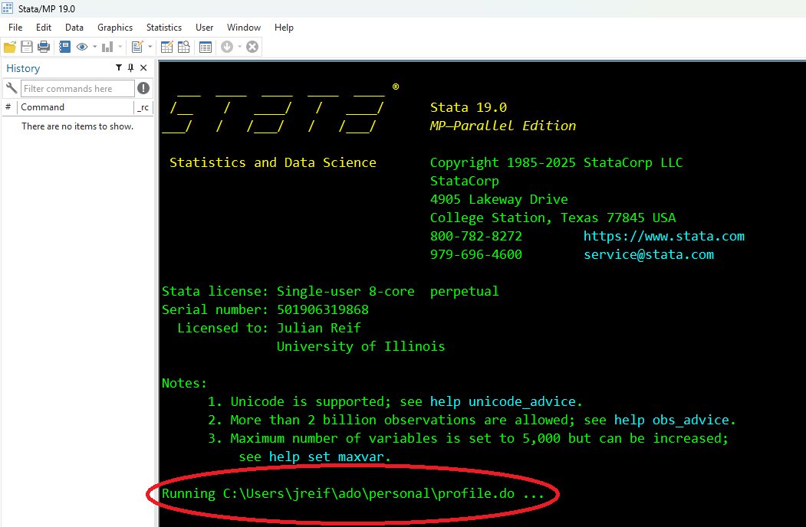
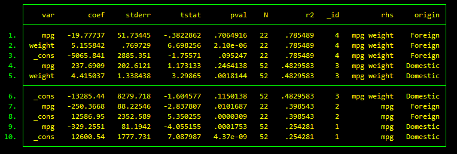
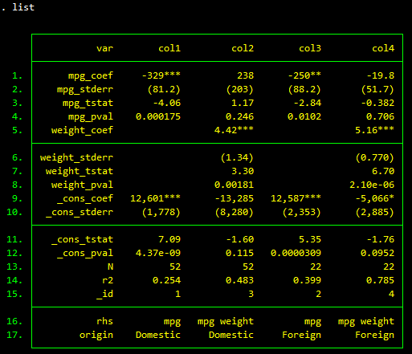
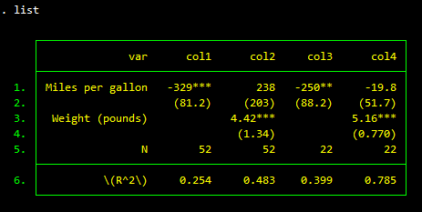
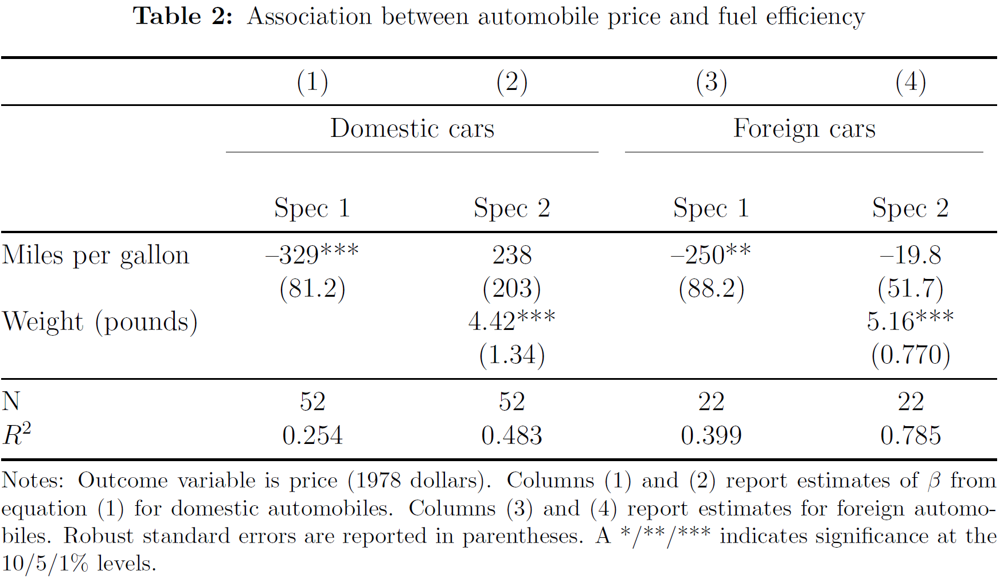

---
title: Stata Coding Guide
permalink: /guide/
layout: single
classes: wide
sidebar:
  nav: "guide"
---


Empirical research in economics has grown in importance thanks to improvements in computing power and the increased availability of rich datasets. Researchers  commonly estimate regressions with millions of observations derived from multiple datasets. Research teams frequently include multiple people working at different universities. Analyses employing confidential data must be performed remotely, often on a non-networked computer at a research data center. Cutting edge analyses may require thousands or millions of lines of code written in multiple languages. 

These recent developments introduce complexity and the potential for non-transparent errors. Peer review rarely evaluates code, even though code often represents the bulk of the work. Research suggests that the results from many published papers [cannot be reproduced](https://igpa.uillinois.edu/sites/igpa.uillinois.edu/files/reports/IGPA__DataTransparency10.14.2021.pdf) from the code and data provided by the original authors. The American Economic Association's (AEA) new [data and code availability policy](https://www.aeaweb.org/journals/policies/data-code) aims to improve this situation by imposing professional standards for coding and documentation. Unfortunately, most researchers (myself included) received little or no training in how to organize projects, write code, or document analyses. 

This guide describes how to set up a robust coding environment and write a "push-button" analysis in Stata. Its purpose is to help researchers:
1. Minimize coding errors
1. Automate the creation of tables and figures
1. Integrate Stata code with supporting R analyses
1. Produce a replication package with the following features: 
  - Compliant with the AEA's [data and code availability policy](https://www.aeaweb.org/journals/policies/data-code)
  - Cross-platform (Mac, Windows, Unix)
  - Runs on a non-networked computer (i.e., no need to download add-ons)

The guide includes an accompanying AEA-compliant [sample replication package](https://github.com/reifjulian/my-project) that you are free to use as a template. Try it out and see how easy (or not!) it is to reproduce my example analysis. If you encounter any difficulties let me know.


# Setting up the environment

I work on several projects at the same time, access them from multiple computers (laptop, home, work), and share them with multiple coauthors. Using multiple environments makes it hard to define the pathname (location) of a folder. A project's location may be **/Users/jreif/my-project** on one computer and **/Users/coauthor/my-project** on another computer. You could manually change this pathname every time a different person or different computer runs the code, but this solution is cumbersome for large projects with many lines of code. Likewise, if you install an add-on on your local computer, it will not be available to your collaborators.

Below I describe how I set up my working environment to address these challenges. Note that users are NOT required to do this in order to run my published code. But, setting up your environment like I do will make it easier to develop your analysis in environments with multiple computers and coauthors. I focus on a setting where code is written in Stata and R. Stata provides native support for running [Python code](https://blog.stata.com/2020/08/18/stata-python-integration-part-1-setting-up-stata-to-use-python/), which I do not discuss here.

## Dropbox

I use Dropbox to sync my projects across environments. Dropbox has several appealing features. It creates backups across multiple computers and the Dropbox server, and in my experience has fewer bugs than alternatives such as Box. Dropbox makes it easy to share files with coauthors. All files stored on Dropbox have the same relative paths, which is helpful when writing scripts (more on this below). [Version control systems](#version-control-systems) can be used as an alternative or complement to Dropbox.

## Stata profile

Stata automatically runs the script **profile.do** upon launch (if found).



**profile.do** must be stored in one of the paths searched by Stata. Type `adopath` at the Stata prompt to view a list of the eligible paths for your particular computer. On my mac, I store this file in **/Users/jreif/Documents/Stata/ado/personal/profile.do**. On my PC, I store it in **C:/ado/personal/profile.do**.

Here are the contents of the Stata profile stored on my PC:
```stata
* Settings specific to local environment
global DROPBOX "C:/Users/jreif/Dropbox"

* Run file containing settings common to all environments
run "$DROPBOX/stata_profile.do"
```

This file contains settings specific to my PC, namely the location of my Dropbox folder. The Stata profile stored on my mac is identical except that it defines a different location for `DROPBOX`. I could also define the locations of all my projects in **profile.do**. But instead, I store those definitions, along with any other settings that are common across my computers, on Dropbox in a script called **stata_profile.do** and then call that script from **profile.do**.

Here are the contents of an example **stata_profile.do** stored on Dropbox:
```stata
set varabbrev off
global MyProject "$DROPBOX/my-project/analysis"
```

The first line, `set varabbrev off`, is a command I want executed every time I open Stata on all my computers, for reasons [I explain below](#stata-coding-tips). The second line defines the location of the analysis for [MyProject](https://github.com/reifjulian/my-project), which I stored on Dropbox. In practice my Stata profile defines a large number of globals, one for every project I am working on. Whenever I start a new project, I define a new global for it and add it to **stata_profile.do**. Because all my computers are synced to Dropbox, I only have to do this once.

## R profile

I write most of my code in Stata, including C++ plugins such as [strgroup](https://github.com/reifjulian/strgroup). On occasion, I will use an R function that is not available in Stata, such as [XGBoost](https://xgboost.readthedocs.io/en/latest/). In these cases I find it convenient to setup an R environment that is consistent with my Stata environment.

Similar to Stata, R automatically runs **.Rprofile** upon launch (if found). This file is typically stored in your home directory, whose location you can find by typing `normalizePath(path.expand("~"),winslash="/")` at the R prompt.

{: .notice--info}
**R Tip:** Additional details regarding how R sets up its environment at startup are available in this [R programming guide](https://web.archive.org/web/20190907041505/https://csgillespie.github.io/efficientR/3-3-r-startup.html#r-startup).

Here are the contents of my R profile, stored in **C:/Users/jreif/Documents/.Rprofile**:
```R
cat("Running .Rprofile...\n\n")

# Settings specific to local environment
Sys.setenv(DROPBOX = "C:/Users/jreif/Dropbox")

# Run file containing settings common to all environments
source(file.path(Sys.getenv("DROPBOX"), "R_profile.R"))
```

As with my Stata profile, my R profile in turn runs a second script located at the top level of my Dropbox directory. This file, **R_profile.R**, stores R settings common across all my computers, such as the paths for all my projects. Here is an example for the MyProject analysis:

```R
Sys.setenv(MyProject = file.path(Sys.getenv("DROPBOX"), "my-project/analysis"))
```

## Version control systems

Version control systems such as Git and SVN are powerful and absolutely necessary for large software development collaborations. I myself use GitHub when developing my [software packages](https://github.com/reifjulian/). However, I personally find these systems unnecessary for academic analyses with a small number of coauthors and which are expected to end after publication. If you're interested in version control, I recommend checking out [Grant McDermott's Git slides](https://raw.githack.com/uo-ec607/lectures/master/02-git/02-Git.html#1).


# Organizing the project

## Folder structure

A project includes lots of different parts: the analysis, the manuscript, related literature, grant proposals, etc. The analysis, which includes both code and data, should be kept in a distinct location. Keeping the analysis separate makes it easier to create a standalone replication package when the project is complete.
A typical analysis starts with raw data (e.g., a dataset downloaded from the web). Scripts process these data and then run the analysis. Scripts and data should be stored in separate folders. The core directory structure for my analyses looks like this:


```text
.
└── analysis/
    ├── data/
    ├── scripts/
        ├── 1_process_raw_data.do
        └── 2_...
    └── run.do		
```

The master script, **run.do**, executes the entire analysis. Running this script creates all necessary additional folders, intermediate files, and results:

```text
.
└── analysis/
    ├── data/
    ├── processed/
    ├── results/
        ├── figures/
        └── tables/
    ├── scripts/
        ├── 1_process_raw_data.do
        └── 2_...
    └── run.do		
```

At any time, you can delete **processed/** and **results/**, keeping only **data/** and **scripts/**, and then rerun your analysis from scratch. When the project is complete, a copy of **analysis/** serves as a standalone replication package.

The folder **scripts/** includes all scripts and libraries (add-on packages) required to run the analysis. **data/** includes raw (input) data and is read-only. Thus, my scripts write files only to **processed/** or **results/**.

The folder **results/** contains all final output, including tables and figures. These can be linked to a LaTeX document on [Overleaf](https://www.overleaf.com) or stored in an adjacent folder. For example, [MyProject](https://github.com/reifjulian/my-project) has the following folder structure:

```text
.
├── analysis/
    ├── data/
    ├── processed/
    ├── results/
        ├── figures/
        └── tables/
    ├── scripts/
        ├── 1_process_raw_data.do
        └── 2_...
    └── run.do
└── paper/
    ├── manuscript.tex
    ├── figures/
    └── tables/
```

To update the MyProject manuscript, copy **analysis/results/figures/** and **analysis/results/tables/** to **paper/**, which contains manuscript files. Additional documents such as literature references can be stored in **paper/** or in a separate, standalone folder at the top the project directory. 

{: .notice--info}
**LaTeX Tip:** Looking for a clean LaTeX template for your manuscript? Feel free to use my [sample manuscript](https://raw.githubusercontent.com/reifjulian/my-project/master/paper/my_paper.tex).

## Programs

Programs (AKA functions, subroutines) are additional pieces of code called by your scripts. These might be do-files, ado-files, or scripts written in another programming language such as R. An introduction to ado-files is available on the [Stata blog](https://blog.stata.com/2015/11/10/programming-an-estimation-command-in-stata-a-first-ado-command). Because programs are not called directly by the master script, **run.do**, I usually store them in the subdirectory **scripts/programs/**. This reduces clutter in large projects with many scripts and many subroutines.

## Libraries

My code frequently employs user-written (add-on) Stata commands, such as [regsave](https://github.com/reifjulian/regsave) or [reghdfe](http://scorreia.com/software/reghdfe/install.html). To ensure replication, it is *very important* to include copies of these programs with your code:
1. A user can't run your code without it.
1. These commands are updated over time, causing your code to break or produce different output.

Many people do not appreciate how code updates can inhibit replication. Here is an example. You perform a Stata analysis using a new, user-written estimation command called, say, `regols`. You publish your paper, along with your replication code, but do not include the code for `regols`. Ten years later a researcher tries to replicate your analysis. The code breaks because she has not installed `regols`. She opens Stata and types `ssc install regols`, which installs the newest version of that command. But, in the intervening ten years the author of `regols` fixed a bug in how the standard errors are calculated. When the researcher runs your code with her updated version of `regols` she finds your estimates are no longer statistically significant. The researcher does not know whether this happens because you included the wrong dataset with your replication, or because there is mistake in the analysis code, or because you failed to correctly copy/paste your output into your publication, or because... Whatever the reason, she cannot replicate your published results and must now decide what to conclude.

Stata takes version control [seriously](https://www.stata.com/features/integrated-version-control/). You should always include a `version` statement in your [master script](https://github.com/reifjulian/my-project/blob/master/analysis/run.do). Writing `version 15` instructs all future versions of Stata to execute its functions the same way Stata 15 did. However, most add-on (user-written) packages are not version controlled.  To address this, I include a script called [_install_stata_packages.do](https://github.com/reifjulian/my-project/blob/master/analysis/scripts/_install_stata_packages.do) in all my working projects. This script installs copies of any user-written packages used by the project into a subdirectory of the project folder: **analysis/scripts/libraries/stata**. Rerunning this script will install updated versions of these add-ons as desired. I delete this script when my project is ready to be published, which effectively locks down the code for these user-written packages and ensures I can replicate my Stata analysis forever into the future. In addition, including these user-written packages ensures my code will run on a non-networked computer that does not have access to the internet.


<div class="notice--info" markdown="1">
**Stata tip:** By default, Stata searches for add-on packages in multiple folders. I recommend disabling this behavior when working on a long-term project, which will ensure that Stata looks for add-ons only in your local project folder when running your project code. The following code in my [master script](https://github.com/reifjulian/my-project/blob/master/analysis/run.do) removes these non-project folders from the search path:
```stata
tokenize `"$S_ADO"', parse(";")
while `"`1'"' != "" {
  if `"`1'"'!="BASE" cap adopath - `"`1'"'
  macro shift
}
adopath ++ "$MyProject/scripts/programs"
```
Note: these changes apply only to the active Stata session. Closing and reopening Stata will revert to the default of searching in multiple folders.
</div>

I am unaware of a version control statement for R, which means the behavior of its built-in functions may [depend](https://f.briatte.org/r/change-in-sample-function-r-3-6-0) on what version of R you are running. As a second-best solution, my [master script](https://github.com/reifjulian/my-project/blob/master/analysis/run.do) uses the Stata add-on command [rscript](https://github.com/reifjulian/rscript) to check whether the user (1) is running a sufficiently recent version of R; and (2) has installed R libraries required by my analysis, such as tidyverse. As with Stata, it is possible to install these add-on packages into your project subdirectory. In practice, doing this in R creates headaches. Add-on packages such as tidyverse are very large (hundreds of megabytes) and--if you want to ensure cross-platform replicability--need to be installed separately for Mac, Unix, and Windows. Doing this for my sample replication project would increase that project's file size by nearly a gigabyte! I therefore again settled for a second-best solution and instead require the user to install these packages themselves. As described in my sample project [README](https://github.com/reifjulian/my-project/blob/master/analysis/README.pdf), the user can install these packages in three different ways: 
1. Manually by typing, e.g., `install.packages(“tidyverse”)` at the R prompt
1. Automatically by opening R and running [_install_R_packages.R](https://github.com/reifjulian/my-project/blob/master/analysis/scripts/programs/_install_R_packages.R)
1. Automatically by uncommenting line 53 of [run.do](https://github.com/reifjulian/my-project/blob/master/analysis/run.do)
 

If you don't mind potentially using up lots of disk space and want to ensure reproducibility, I highly recommend installing your R packages in the project subdirectory just like I did with Stata. See the commented out code in [_install_R_packages.R](https://github.com/reifjulian/my-project/blob/master/analysis/scripts/programs/_install_R_packages.R) for an example. Following this example will result in a folder structure that looks like this:

```text
.
└── analysis/
    ├── data/
    └── scripts/
        ├── libraries/
    	    ├── R/
                ├── linux/
                ├── osx/			
                └── windows/				
    	    └── stata/
        ├── programs/
        ├── 1_process_raw_data.do
        └── 2_...
    └── run.do		
```
Other alternatives--used frequently by serious users of R--include [packrat](https://rstudio.github.io/packrat/), [renv](https://rstudio.github.io/renv/articles/renv.html), and [groundhog](https://groundhogr.com/).

### Stata plugins (advanced)

Most Stata add-ons are written in Stata or Mata, which are cross-platform languages that run on any computer with a copy of Stata. A small number of Stata add-ons are written in C/C++ and must be compiled to a plugin (AKA dynamically linked library, or DLL) that is specific to your computer's architecture. Mauricio Bravo provides a nice [example](https://mcaceresb.github.io/stata/plugins/2017/02/15/writing-stata-plugins-example.html) of the benefits of plugins.

If you write C/C++ code for Stata, I encourage you to compile it for multiple platforms and include all platform-specific plugins as part of your replication package. See [gtools](https://github.com/mcaceresb/stata-gtools) and [strgroup](https://github.com/reifjulian/strgroup) for examples of how to write a program that autodetects which plugin to call based on your computer's architecture. 

# Automating tables

Automating your tables and figures facilitates data updates and minimizes mistakes that can arise when transferring results from Stata to your manuscript. Automating figures is easy using Stata's `graph export` command. Automating tables usually requires customized add-ons. 

There are many ways to automate tables in Stata. Below I present my preferred method, which uses Stata add-ons I developed for prior projects. This method is targeted at people who use LaTeX and desire flexible control over their table formatting; users interested only in learning about how to save regression results can read about `regsave` and skip the part about `texsave`. For examples of the kinds of tables you can automate in Stata using my add-ons, see my papers on [workplace wellness](https://www.nber.org/workplacewellness/s/IL_Wellness_Study_1.pdf) or [teenage driving](https://julianreif.com/research/reif.aeri.2021.driving.pdf). Popular alternatives to my add-ons include [estout](http://repec.sowi.unibe.ch/stata/estout/index.html) and [outreg2](https://www.princeton.edu/~otorres/Outreg2.pdf).

My method separates automation into two distinct steps. The first step uses [regsave](https://github.com/reifjulian/regsave) to save regression output to a file. The second step uses [texsave](https://github.com/reifjulian/texsave) to save the output in LaTeX format. In-between these two steps you can use Stata's built-in data manipulation commands to organize your table however you like.

## regsave

`regsave` is a Stata add-on that stores regression results. To install the latest version, run the following at your Stata prompt:
```stata
net install regsave, from("https://raw.githubusercontent.com/reifjulian/regsave/master") replace
```

The `regsave` [online documentation](https://github.com/reifjulian/regsave) provides a full tutorial. Below, I demonstrate it using examples from my [sample replication package](https://github.com/reifjulian/my-project). This code is a good example of how I use it in most of my analyses.

We begin by running the following code from the script [3_regressions.do](https://github.com/reifjulian/my-project/blob/master/analysis/scripts/3_regressions.do):
```stata
tempfile results
use "$MyProject/processed/auto.dta", clear

local replace replace
foreach rhs in "mpg" "mpg weight" {
	
  * Domestic cars
  reg price `rhs' if foreign=="Domestic", robust
  regsave using "`results'", t p autoid addlabel(rhs,"`rhs'",origin,Domestic) `replace' 
  local replace append
	
  * Foreign cars
  reg price `rhs' if foreign=="Foreign", robust
  regsave using "`results'", t p autoid addlabel(rhs,"`rhs'",origin,"Foreign") append
}
```

This code estimates four different regressions and saves the results to a tempfile, `results`. Let's open that file and look at the contents.

```stata
use "`results'", clear
list
```



The file contains the regression coefficients, standard errors, t-statistics, p-values, etc. from each of the four regressions. We could have saved more information, such as confidence intervals, by specifying the appropriate option. Type `help regsave` to see the full set of options. 

This output file can be easily analyzed and manipulated, but it is not ideal for table presentation. We can convert this "long" table to a "wide" table using the `regsave_tbl` helper function. Here is the relevant code from [4_make_tables_figures.do](https://github.com/reifjulian/my-project/blob/master/analysis/scripts/4_make_tables_figures.do):

```stata
tempfile my_table
use "$MyProject/results/intermediate/my_regressions.dta", clear

* Merge together the four regressions into one table
local run_no = 1
local replace replace
foreach orig in "Domestic" "Foreign" {
  foreach rhs in "mpg" "mpg weight" {
		
    regsave_tbl using "`my_table'" if origin=="`orig'" & rhs=="`rhs'", name(col`run_no') asterisk(10 5 1) parentheses(stderr) sigfig(3) `replace'
		
    local run_no = `run_no'+1
    local replace append
  }
}
```

This code converts each saved regression to "wide" format and saves it to the tempfile `my_table`. Let's open that tempfile and look at its contents:

```stata
use "`my_table'", clear
list
```



This "wide" format is much more appropriate for a table. Of course, we still need to clean it up. For example, you may not want to report t-statistics or estimates of the constant term. In the next step below we will format the table and use `texsave` to output the table into a LaTeX file.

## texsave

[texsave](https://github.com/reifjulian/texsave) is a Stata add-on that saves a dataset as a LaTeX text file. To install the latest version, type the following at your Stata prompt:

```stata
net install texsave, from("https://raw.githubusercontent.com/reifjulian/texsave/master") replace
```

We first reformat the dataset that was produced using `regsave_tbl`:

```stata
use "`my_table'", clear
drop if inlist(var,"_id","rhs","origin") | strpos(var,"_cons") 
drop if strpos(var,"tstat") | strpos(var,"pval")

* texsave will output these labels as column headers
label var col1 "Spec 1"
label var col2 "Spec 2"
label var col3 "Spec 1"
label var col4 "Spec 2"

* Display R^2 in LaTeX math mode
replace var = "\(R^2\)" if var=="r2"

* Clean variable names
replace var = subinstr(var,"_coef","",1)
replace var = "" if strpos(var,"_stderr")
replace var = "Miles per gallon"     if var=="mpg"
replace var = "Weight (pounds)"      if var=="weight"
replace var = "Price (1978 dollars)" if var=="price"

list
```

This code first removes output I didn't want to report in this table, such as t-statistics and estimates of the constant term. It then labels the four columns of estimates. As we shall see, those Stata labels will serve as column headers in the LaTeX table. The code then rewrites `r2` using LaTeX math syntax. The final lines of the code provide more descriptive labels for the regressors. Typing `list` shows that our table now looks like this:



{: .notice--info}
**LaTeX Tip:** You can indicate a math environment in LaTeX using either `\(...\)` or `$...$` syntax. It's usually easier to use the `\(...\)` syntax because `$` marks global macros in Stata.

We are now ready to save the table in LaTeX format using `texsave`. We will provide a title, some additional LaTeX code for the header of the table, and a footnote:

```stata
local title "Association between automobile price and fuel efficiency"
local headerlines "& \multicolumn{2}{c}{Domestic cars} & \multicolumn{2}{c}{Foreign cars} " "\cmidrule(lr){2-3} \cmidrule(lr){4-5}"
local fn "Notes: Outcome variable is price (1978 dollars). Columns (1) and (2) report estimates of \(\beta\) from equation (\ref{eqn:model}) for domestic automobiles. Columns (3) and (4) report estimates for foreign automobiles. Robust standard errors are reported in parentheses. A */**/*** indicates significance at the 10/5/1\% levels."
texsave using "$MyProject/results/tables/my_regressions.tex", autonumber varlabels hlines(-2) nofix replace marker(tab:my_regressions) title("`title'") headerlines("`headerlines'") footnote("`fn'")
```

Finally, we can copy the output file, **my_regressions.tex**, to **paper/tables/** and then link to it from our LaTeX [manuscript](https://github.com/reifjulian/my-project/blob/master/paper/my_paper.tex) using the LaTeX code `\input{tables/my_regressions.tex}`. After compiling the manuscript, our table looks like this:



# Submission checklist

You completed your analysis, wrote up your results, and are ready to submit to a journal! Before doing so, check that all your numbers are reproducible. If there are any mistakes in the code, better to find them now rather than later! Follow these steps to replicate your analysis:

1. Make a copy of the **analysis/** folder. For the remaining steps below, work only with this copy. It will become your "replication package."

1. Rerun your analysis from scratch:

    - Delete the **processed/** and **results/** folders.

    - Execute **run.do** to regenerate all tables and figures using just the raw data.

1. Confirm that the reproduced output in **results/figures/** and **results/tables/** matches the results reported in your manuscript.

1. Remove **_install_stata_packages.do** from **scripts/**.

1. Include a license. If your package includes both data and code, the AEA suggests [combining](https://aeadataeditor.github.io/aea-de-guidance/licensing-guidance#dual-license-example) a Modified BSD License (for code) with a Creative Commons Attribution 4.0 International Public License (for data). To do this, copy their [dual license template](https://raw.githubusercontent.com/AEADataEditor/aeadataeditor.github.io/main/_guidance/LICENSE-template.txt) to your folder and edit the line `COPYRIGHT <YEAR> <COPYRIGHT HOLDER>` to reflect the year and the authors.

1. Add a [README file](https://github.com/reifjulian/my-project/blob/master/analysis/README.pdf). The AEA provides a number of [templates](https://zenodo.org/record/4319999#.YZYla5DML0o) in different formats. A minimal README should include the following information:
  - Title and authors of the paper
  - Required software, including version numbers
  - Clear instructions for how to run the analysis 
  - Description of the raw data and where it is stored
  - Explanations for missing data (e.g., data are confidential or proprietary) and how to obtain them 
  - Description of each script
  - Description of where the output is stored

1. (Optional) Upload to a secure data archive.
  - The [ICPSR data enclave](https://www.icpsr.umich.edu/icpsrweb/content/ICPSR/access/restricted/enclave.html) is one option.

{: .notice--info}
**Tip:** Step 3--confirming output--can be tedious. Including `assert` statements in Stata, or `stopifnot()` statements in R, makes checking output easier. For example, if the main result of your study is a regression estimate of $1.2 million, include an assertion in your code that will fail should this number change following a new data update. Stata examples are available in this [sample script](https://github.com/reifjulian/my-project/blob/master/analysis/scripts/4_make_tables_figures.do).

# Stata coding tips

- Use forward slashes for pathnames (`$DROPBOX/project` not `$DROPBOX\project`). Backslashes are an escape character in Stata and can cause problems depending on what operating system you are running. Using forward slashes ensures cross-platform compatibility.

- Never use hard-coded paths like **C:/Users/jreif/Dropbox/my-project**. All pathnames should reference a global variable defined either in your Stata profile or in your [master script](https://github.com/reifjulian/my-project/blob/master/analysis/run.do). Anyone should be able to run your entire analysis from their computer without having to edit any scripts, with the exception of defining a single global variable in **run.do**.

- Avoid spaces and capital letters in file and folder names. Case sensitivity varies across different file systems, and spaces create nuisances when working from the command line or with weblinks. (Your files and folders may eventually be made available online!) 

- Include `set varabbrev off` in your Stata profile.  This helps you avoid mistakes such as accidently [referencing the wrong variable](https://www.ifs.org.uk/docs/stata_gotchasJan2014.pdf).

- When working with large datasets, use Mauricio Bravo's [gtools](https://github.com/mcaceresb/stata-gtools) and Sergio Correia's [reghdfe](http://scorreia.com/software/reghdfe/).

- Rewrite your code frequently and make it readable. Provide helpful comments in the code and make your variable names meaningful (but short). Provide more detailed descriptions using the `label variable` command. Always include units in the label.

- Sometimes an analysis may inexplicably produce different results despite no changes to the code. Here are two common reasons why this happens:
  1. One of your commands requires random numbers and you forgot to use `set seed #`
  1. You have a nonunique sort. Add `isid` checks to your code prior to sorting to ensure uniqueness. (Another option is to add the `stable` option to your sorts.) Nonunique sorts can be hard to spot:

```stata
* Stata's default type is float
* With N=100,000 a randomly generated float may not be unique
* isid produces error unless you set Stata's default type to double
clear
set seed 100
set obs 100000
gen r = uniform()
isid r

* Cast r as a double to avoid this problem
clear
set seed 100
set obs 100000
gen double r = uniform()
isid r
```


# Other helpful links

[Asjad Naqvi's Stata-to-LaTeX guide](https://medium.com/the-stata-guide/the-stata-to-latex-guide-6e7ed5622856)

[AEA Data Editor's guide](https://aeadataeditor.github.io/aea-de-guidance/)
- Additional guidance at the [Social Science Data Editors site](https://social-science-data-editors.github.io/guidance/)

[Dan Sullivan's best practices for coding](http://www.danielmsullivan.com/pages/tutorial_workflow_3bestpractice.html)

[Gentzkow and Shapiro coding guide](https://web.stanford.edu/~gentzkow/research/CodeAndData.pdf)

[Grant McDermott's data science lectures](https://github.com/uo-ec607/lectures)

[Lars Vilhuber's presentation on transparency and reproducibility](https://zenodo.org/record/3735536#.XopGfqhKguU)

[Poverty Action Stata Data and Coding Guide](https://povertyaction.github.io/guides/cleaning/readme/)

[Roger Koenker's guide on reproducibility](http://www.econ.uiuc.edu/~roger/research/repro)

[Sean Higgin's Stata guide](https://github.com/skhiggins/Stata_guide)


# Acknowledgments

The coding practices outlined in this guide have been developed over many years. I would especially like to thank my frequent collaborators Tatyana Deryugina and David Molitor for providing many helpful suggestions that have improved my project organization. I also thank Grant McDermott for several helpful conversations regarding version control and reproducibility in R.
